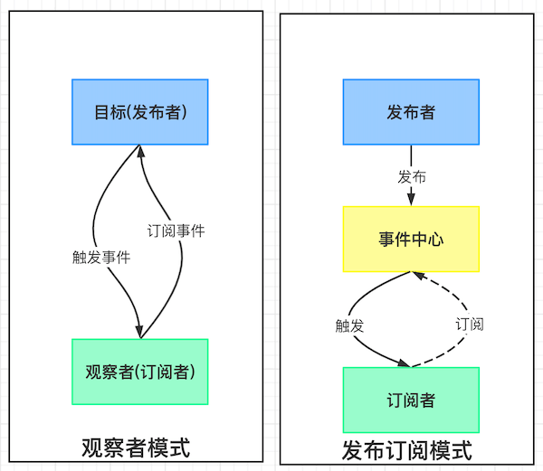
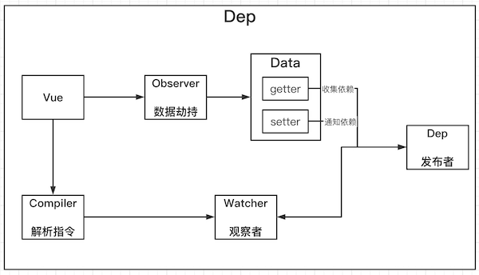
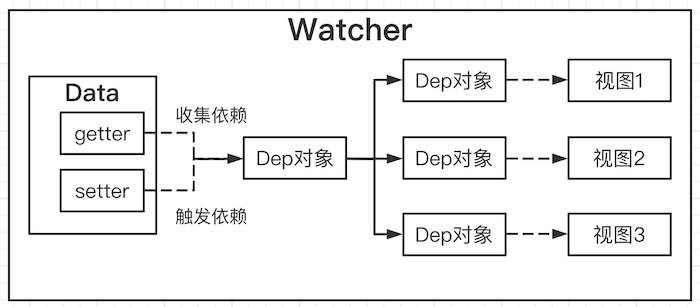
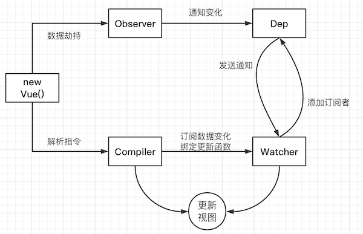

# Vue 响应式原理模拟

## 课程目标
- 模拟一个最小版本的 Vue
- 响应式原理在面试的常问问题
- 学习别人优秀的经验，转换成自己的经验
- 实际项目中出问题的原理层面的解决
  - 给 Vue 实例新增一个成员是否是响应式的？
  - 给属性重新赋值成对象，是否是响应式的？
- 为学习 Vue 源码做铺垫

## 准备工作
- 数据驱动
- 响应式的核心原理
- 发布订阅模式和观察者模式
### 数据驱动
- 数据响应式、双向绑定、数据驱动
- 数据响应式
  - 数据模型仅仅是普通的 JavaScript 对象，而当我们修改数据时，视图会进行更新，避免了繁琐的 DOM 操作，提高开发效率
- 双向绑定
  - 数据改变，视图改变；视图改变，数据也随之改变
  - 我们可以使用 v-model 在表单元素上创建双向数据绑定
- 数据驱动也是 Vue 最独特的特性之一
  - 开发过程中仅需要关注数据本身，不需要关心数据是如何渲染到视图

### 数据响应式的核心原理

#### Vue 2.x
- [Vue 2.x深入响应式原理](https://cn.vuejs.org/v2/guide/reactivity.html)
- [MDN-Object.defineProperty](https://developer.mozilla.org/zh-CN/docs/Web/JavaScript/Reference/Global_Objects/Object/defineProperty)
- 游览器兼容 IE8 以上(不兼容 IE8 )
```js
// 模拟 Vue 中的 data 选项
let data = {
  msg: 'hello'
}

// 模拟 Vue 的实例
let vm = {}

// 数据劫持：当访问或者设置 vm 中的成员时，做一个干预操作
Object.defineProperty(vm, 'msg', {
  // 可枚举
  enumerable: true,
  // 可配置（可使用 delete 删除，可以通过 defineProperty 重新定义）
  configurable: true,
  // 当获取值的时候执行
  get () {
    console.log('get:', data.msg)
    return data.msg
  }
  set (newValue) {
    console.log('set:', newValue)
    if (newValue === data.msg) {
      return
    }
    data.msg = newValue
    // 数据更改，更新 DOM 的值
    document.querySelector('#app').textContent = data.msg
  }
})

// 测试
vm.msg = 'Hello World'
console.log(vm.msg)
```
- 如何给对象中所有属性设置 getter/setter ?
```js
function proxyData(data) {
  // 遍历 data 对象所有属性
  Object.keys(data).forEach(key => {
    // 把 data 中的属性，转换成 vm 的 getter/setter
    Object.defineProperty(vm, key, {
      enumerable: true,
      configurable: true,
      get () {
        console.log('get:', data[key])
        return data[key]
      }
      set (newValue) {
        console.log('set:', newValue)
        if (newValue === data.msg) {
          return
        }
        data.msg = newValue
        // 数据更改，更新 DOM 的值
        document.querySelector('#app').textContent = data.msg
      }
    })
  })
}
```

#### Vue 3.x
- [MDN-Proxy](https://developer.mozilla.org/zh-CN/docs/Web/JavaScript/Reference/Global_Objects/Proxy)
- 直接监听对象，而非属性。
- ES6 中新增，IE不支持，性能由游览器优化
```js
// 模拟 Vue 中的 data 选项
let data = {
  msg: 'hello',
  count: 0
}
// 模拟 Vue 实例
let vm = new Proxy(data, {
  // 当访问 vm 的成员会执行
  get (target, key) {
    console.log('get,key:', key, target[key])
    return target[key]
  }
  // 当设置 vm 的成员会执行
  set (target, key, newValue) {
    console.log('set,key:', key, newValue)
    if (newValue === target[key]) {
      return
    }
    target[key] = newValue
  }
})
```

### 发布订阅模式和观察者模式

#### 发布/订阅模式
- 发布/订阅模式
  - 订阅着
  - 发布者
  - 信号中心
  > 我们假定，存在一个"信号中心"，某个任务执行完成，就向信号中心"发布"（publish）一个信号，其他任务可以向信号中心"订阅"（subscribe）这个信号，从而知道什么时候自己可以开始执行。**这就叫做"发布/订阅模式"（publish-subscribe pattern）**
  - Vue 的自定义事件
    - https://cn.vuejs.org/v2/guide/components-custom-events.html
    ```js
     let vm = new Vue()

     vm.$on('dataChange', () => {
       console.log('dataChange')
     })
     vm.$on('dataChange', () => {
       console.log('dataChange1')
     })
     vm.$emit('dataChange')
    ```
    - 兄弟组件通信过程
    ```js
    // eventBus.js
    // 事件中心
    let eventHub = new Vue()

    // ComponentA.vue
    // 发布者
    addTodo: function() {
      // 发布消息(事件)
      eventHub.$emit('add-todo', { text: this.newTodoText })
      this.newTodoText = ''
    }
    // ComponentB.vue
    // 订阅者
    created: function () {
      // 订阅消息(事件)
      eventHub.$on('add-todo', this.addTodo)
    }
    ```
    - 模拟 Vue 自定义事件的实现
    ```js
    // 事件中心
    class EventEmitter {
      constructor () {
        // 订阅者 { eventType: [handler1, handler2] }
        this.subs = {}
      }
      // 订阅通知
      $on (eventType, handler) {
        this.subs[eventType] = this.subs[eventType] || []
        this.subs[eventType].push(handler)
      }
      // 发布通知
      $emit (eventType) {
        if (this.subs[eventType]) {
          this.subs[eventType].forEach(handler => {
            handler()
          })
        }
      }
    }
    ```

#### 观察者模式
  - 观察者(订阅者) --Watcher
    - update(): 当事件发生时，具体要做的事情
  - 目标(发布者) --Dep
    - subs 数组: 存储所有的观察者
    - addSub(): 添加观察者
    - notify(): 当事件发生，调用所有观察者的 `update()`方法
  - 没有事件中心
  ```js
  // 目标(发布者)
  // Dependency
  class Dep {
    constructor () {
      // 存储所有的观察者
      this.subs = []
    }
    // 添加观察者
    addSub (sub) {
      if (sub && sub.update) {
        this.subs.push(sub)
      }
    }
    // 通知所有观察者
    notify () {
      this.subs.forEach(sub => {
        sub.update()
      })
    }
  } 
  ```

#### 总结
- **观察者模式**是由具体目标调整，比如当事件触发，Dep 就会去调用观察者的方法，所有观察者模式的订阅者与发布者之间存在依赖
- **发布/订阅模式**由统一调度中心调用，因此发布者和订阅者不需要知道对方的存在。


## 模拟Vue响应式

### 整体分析
  - Vue 基本结构
  - 打印 Vue 实例观察
  - 整体结构
  - Vue
    - 把 data 中的成员注入到 Vue 实例，并且把 data 中的成员转成 getter/setter
  - Observer
    - 能够对数据对象的所有属性进行监听，如有变动可拿到最新值并通知 Dep
### minVue
  - 功能
    - 负责接收初始化的参数(选项)
    - 负责把 data 中的属性注入到 Vue 实例，转换成 getter/setter
    - 负责调用 observer 监听 data 中所有属性的变化
    - 负责调用 compiler 解析指令/差值表达式
  - 结构
  ```
          Vue
  ----------------------
  + $options
  + $el
  + $data
  ----------------------
  - _proxyData()
  ```
  - 代码(./minVue/js/vue.js)
#### Observer
  - 功能
    - 负责把 data 选项中的属性转换成响应式数据
    - data 中的某个属性也是对象，把该属性转换成响应式数据
    - 数据变化发送通知
  - 结构
  ```
        Observer
  ----------------------
  + walk(data)
  + defineReactive(data, key, value)
  ```
  - 代码(./minVue/js/observer.js)
#### Compiler
  - 功能
    - 负责编译模版，解析指令/差值表达式
    - 负责页面的首次渲染
    - 当数据变化后重新渲染视图
  - 结构
  ```
        Compiler
  ---------------------
  + el
  + vm
  ---------------------
  + compile(el)
  + compileElement(node)
  + compileText(node)
  + isDirective(attrName)
  + isTextNode(node)
  + isElementNode(node)
  ```
  - 代码(./minVue/js/compiler.js)

#### Dep(Dependency)

  - 功能
    - 收集依赖，添加观察者（watcher）
    - 通知所有观察者
  - 结构
  ```
          Dep
  ---------------------
  + subs
  + addSub(sub)
  + notify()
  ```
  - 代码(./minVue/js/dep.js)
#### Watcher(观察者)

  - 
  - 功能
    - 当数据发生变化触发依赖，dep 通知所有 Watcher 实例更新视图
    - 自身实例化时往 dep 中添加自身
  - 结构
  ```
        Watcher
  ---------------------
  + vm
  + key
  + cb
  + oldValue
  ---------------------
  + update()
  ```
#### 总结

  - 问题
    - 给属性重新赋值成对象，是否时响应式的？`是`
    - 给 Vue 实例新增一个成员是否时响应式的？`不是`
  - 通过下图回顾整体流程


